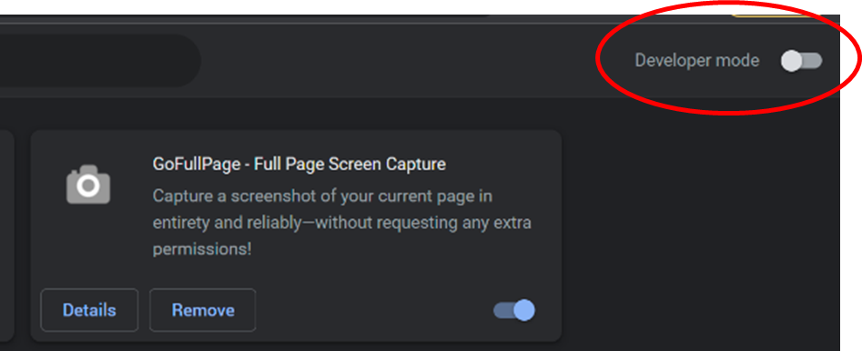
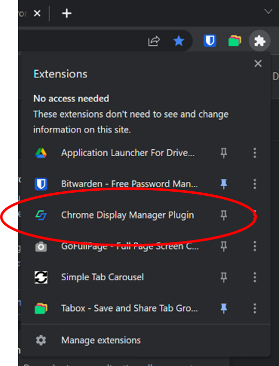
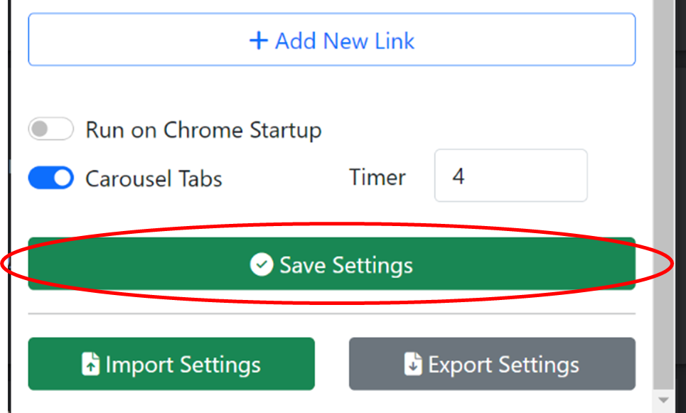
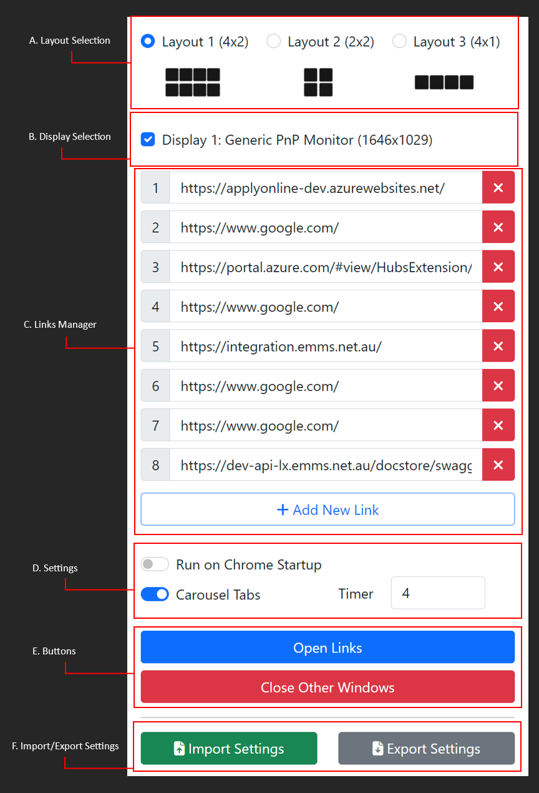

<h2> INSTALLATION: </h2>

1.  In google chrome, go to chrome://extensions/

2.  Enable developer mode

3.  Click *"Load unpacked"* and select the whole project folder

4. Open the plugin via extensions bar on chrome. (You can also pin the extension to access it instantly.)

5.  The settings will be loaded from the *config.json* and display from UI. Scroll down and click *"Save settings"* Restart chrome.

6.  Installation complete. You can now use it after restarting the chrome.

<h2> ANATOMY: </h2>

A.  Layout Selection -- choose layouts of windows from grids 4x2, 2x2, 4x1.

B.  Display Selection -- choose which monitors should the windows be displayed. (This is excluded in the import or export settings)

C.  Links Manager -- add, edit and delete links to be opened by the extension.

D.  Settings

    i.  Run on chrome startup -- enables to automatically open links on chrome starts

    ii.  Carousel tabs -- enables to automatically switch tabs once the links are opened

    iii.  Carousel timer -- allows to set the time (seconds) when to switch tabs

E.  Action Buttons

    i.  Open Links -- if run on chrome startup is disabled, use this button to manually open the links

    ii.  Close Other Windows -- allows to close all the windows opened except the current window

F.  Import/Export Settings

    i.  Import -- allows to import the settings from another device via json file. The format should be the same from the project's *config.json.* This will replace the user's current settings.

    ii.  Export -- allows to export the current settings in project's *config.json* format
